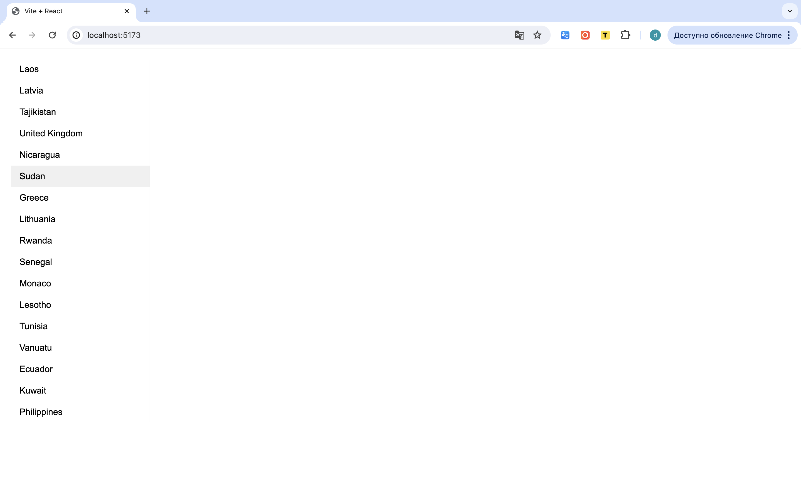
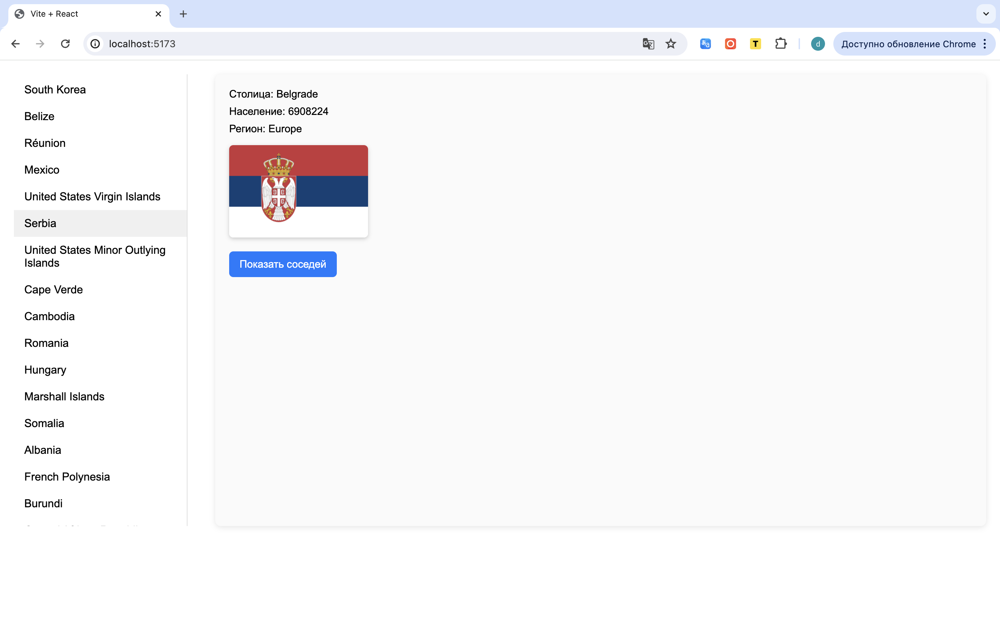
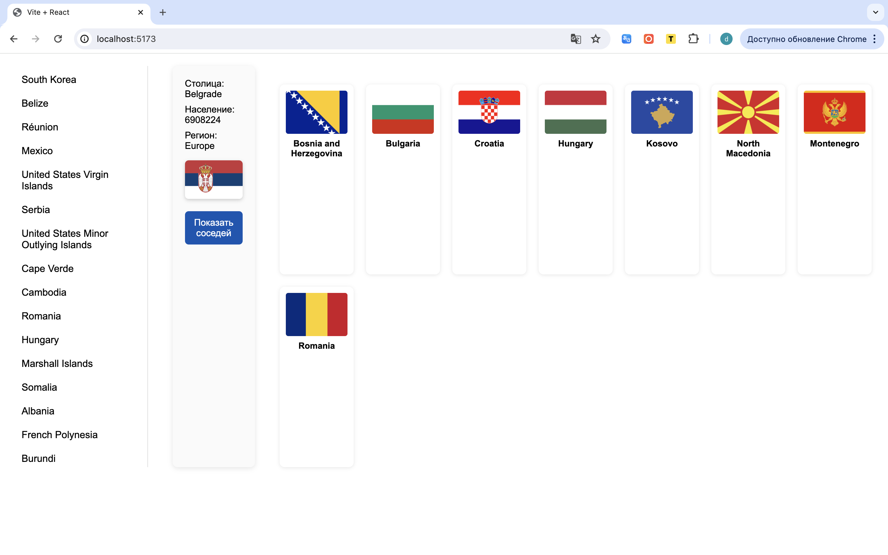

#Countries App

Приложение на React, которое показывает список стран с подробной информацией о каждой.  
Можно выбрать страну, посмотреть её столицу, регион, население и флаг, а также отобразить список соседних стран.

---

## Возможности
- Список всех стран мира
- Детальная информация о стране
- Отображение флага
- Соседние страны (по границам)
- Красивые стили с помощью CSS-модулей

---

## 🛠️ Используемые технологии
- [React]
- [Vite]
- CSS Modules
- [REST Countries API](https://restcountries.com/)

---

## Скриншоты

### Главный экран

### Окно с деталями страны

### Окно с соседями по границе

## Планы на будущее

- Добавить поиск по странам
- Сделать переключение темы (светлая/тёмная)
- Добавить сортировку и фильтры
- Красивое модальное окно для деталей

Разработано в рамках обучения React.
